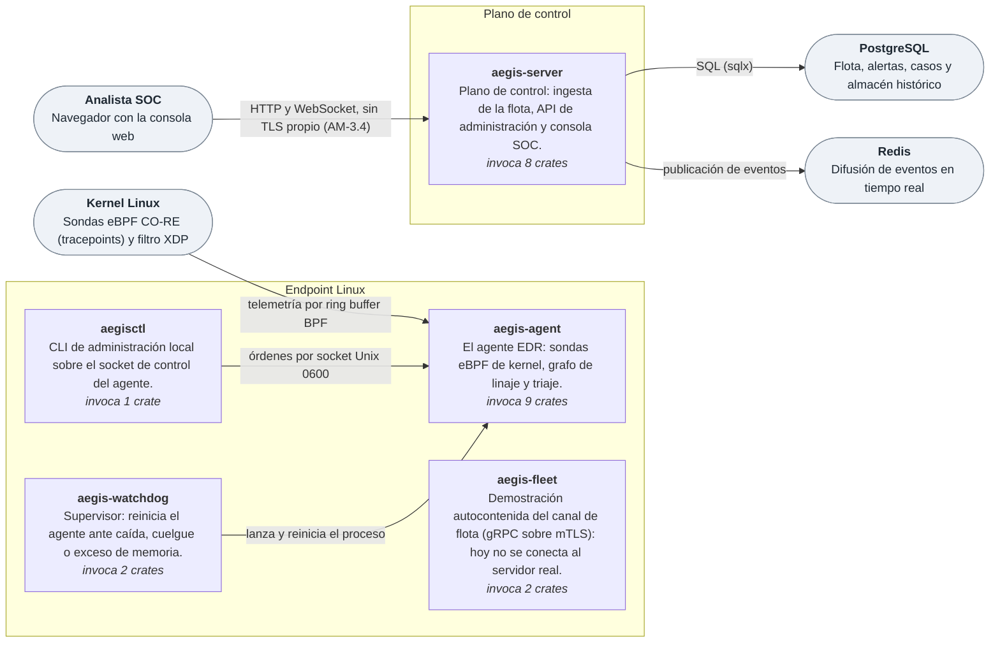

<!--
  GENERADO por `cargo xtask docs`. NO SE EDITA AQUI.
  La prosa vive en docs/plantillas/README.md y los datos en tools/config/.
-->

# AegisCore

**EDR/XDR para Linux escrito en Rust.** Telemetría desde el kernel con eBPF,
correlación y respuesta en el endpoint, y un plano de control para la flota. Sin
bloatware: solo detección, aislamiento y respuesta.

> **Cómo leer este documento.** Todo lo que aquí es una cifra, una tabla de
> estado o un diagrama se **genera desde el código** (`cargo xtask docs`) y una
> puerta de `make ci` falla si deja de coincidir. Lo que se afirma sin cifra es
> diseño. Lo que no funciona todavía está escrito más abajo, en
> [Huecos conocidos](#huecos-conocidos), y no en una nota al pie.

## Estado del producto

Un componente cuenta como **Producto** solo si lo ejecuta un binario instalable,
lo ejerce una prueba de extremo a extremo sobre kernels reales y está medido.
Todo lo demás es **Biblioteca**: código probado que hoy no protege ninguna
máquina.

| Espacio de trabajo | Producto | Condicional | Biblioteca | Herramienta |
|---|---:|---:|---:|---:|
| Agente (`crates/`) | 1 | 0 | 69 | 1 |
| Plano de control (`server/crates/`) | 0 | 0 | 19 | 1 |
| Enjambre (`swarm-net/`) | 0 | 0 | 1 | 0 |

**Producto** = lo invoca un ejecutable instalable, lo ejerce una prueba de extremo a extremo en la matriz de kernels y tiene una medida. **Condicional** = lo mismo, pero depende de hardware o de un certificado y lo declara. **Biblioteca** = código probado que hoy no protege ninguna máquina. Detalle crate a crate, con lo que le falta a cada uno: [matriz de capacidades](docs/matriz-capacidades.md).

## En cifras

| Magnitud | Agente | Plano de control | Enjambre |
|---|---:|---:|---:|
| Crates | 71 | 20 | 1 |
| Funciones de prueba | 3.297 | 1.216 | 6 |
| Líneas de Rust | 229.762 | 92.627 | 555 |

Además: **3.798** líneas de C propio (sondas eBPF y driver de Windows, sin contar el `vmlinux.h` generado), **56** verificadores `tools/verificar-*.sh`, **39** dependencias directas del agente con su justificación en [`tools/lineabase-agente.txt`](tools/lineabase-agente.txt), y **5** ejecutables instalables.

## Por qué otro antivirus

Las suites comerciales fallan en dos ejes a la vez. Por un lado se han convertido
en plataformas de venta cruzada: VPN, limpiador de registro, gestor de
contraseñas, avisos de renovación. Por otro, su detección sigue anclada en firmas
de fichero justo cuando el malware moderno ha dejado de tocar el disco: ejecución
en memoria, *living off the land*, llamadas al sistema directas para saltarse los
ganchos de espacio de usuario, y ransomware que cifra miles de ficheros antes de
que un escaneo programado se entere.

AegisCore ataca el problema desde donde el atacante no puede mentir: el kernel.
Un proceso puede desengancharse de sus bibliotecas, falsificar su proceso padre o
ejecutar código que nunca existe como fichero. Lo que no puede hacer, sin haber
comprometido antes el propio kernel, es ocultarle al kernel lo que hace.

## Principios de diseño

| Principio | Compromiso concreto | Cómo se verifica |
|---|---|---|
| **Verdad antes que cobertura** | Cada capacidad se declara Producto, Condicional o Biblioteca según lo que se ejecuta, no según lo que se escribió | [Matriz de capacidades](docs/matriz-capacidades.md), generada de los binarios |
| **Nunca en silencio** | Una familia de telemetría que no se puede sostener es `SinDatos` y se dice al arrancar; nunca «limpio» | `aegis-agent --capacidades` en cada kernel de la matriz |
| **Eficiencia permanente** | Presupuesto de memoria por clase de host, impuesto por el kernel | Tabla de abajo, calculada con el código del agente; cgroup v2 |
| **Cero bloatware** | Solo defensa, detección, aislamiento y respuesta | Revisión: lo que no reduce el riesgo de compromiso no entra |
| **Seguridad de memoria** | Rust; `unsafe` prohibido salvo con justificación escrita | `tools/lineabase-unsafe.txt` y la invariante que la comprueba |
| **La nube fuera de la decisión** | El veredicto local manda y bloquea; la nube solo refina después | Pruebas con el enlace cortado de verdad |

## Presupuesto de recursos

El agente no gasta un número fijo: gasta una **fracción de la RAM del host, con
suelo y con techo**. La fracción hace que escale, el suelo mantiene capaz al
host pequeño y el techo impide que en un host enorme el agente crezca solo
porque puede. Hay tres regímenes, porque vigilar, escanear y amenazar al host
son situaciones distintas:

- **Reposo**: vigilancia sin trabajo pesado. Es lo que el administrador ve casi
  siempre.
- **Pico**: escaneo completo, recarga de firmas, desempaquetado. Es transitorio;
  quedarse aquí es la señal de contención.
- **Techo duro**: a partir de aquí el agente es un riesgo para la máquina que
  protege. El cgroup lo detiene y el watchdog lo levanta.

| Clase de host | RAM | Reposo | Pico | Techo duro | % del host (techo) |
|---|---:|---:|---:|---:|---:|
| Pasarela IoT | 1 GiB | 48 MiB | 96 MiB | 160 MiB | 15,62 % |
| Portátil | 8 GiB | 48 MiB | 163 MiB | 245 MiB | 2,99 % |
| Estación | 16 GiB | 81 MiB | 327 MiB | 491 MiB | 2,99 % |
| Servidor | 64 GiB | 327 MiB | 1,0 GiB | 1,5 GiB | 2,34 % |
| Host de base de datos | 768 GiB | 384 MiB | 1,0 GiB | 1,5 GiB | 0,19 % |

<sub>Calculada por `cargo xtask docs` con `aegis_presupuesto::Presupuesto::para`, el mismo código que aplica el agente.</sub>

En una pasarela pequeña el agente es una parte apreciable del host, y la tabla
lo dice en vez de disimularlo: quien decide si lo despliega tiene que saberlo.

Tres capas lo imponen, y la tercera existe porque las dos primeras las ejecuta un
proceso que puede estar comprometido o simplemente tener un fallo:

| Capa | Quién la aplica | Qué hace |
|---|---|---|
| Reparto | Cada componente, vía `Presupuesto::cuota` | Pide lo que le toca en vez de llevar una constante inventada |
| Contención | El agente sobre sí mismo | Suelta lo elástico y rechaza trabajo pesado **antes** de llegar al techo |
| Obligación | El **kernel**, vía `MemoryHigh`/`MemoryMax` de cgroup v2 | Detención dentro del cgroup y reinicio, sin tocar al host |

## Arquitectura



<sub>Generado desde `tools/config/instalables.toml` y `tools/config/documentacion.toml`. Cada flecha exige una evidencia en el código; una relación que no existe no se puede dibujar.</sub>

**La decisión central:** la nube está fuera de la ruta de decisión. El veredicto
local es autoritativo y bloquea; la nube solo refina a posteriori. Un diseño que
exija una consulta remota para permitir una ejecución añade latencia de red a
cada proceso nuevo y deja la máquina sin protección en cuanto cae el enlace.

Los **dos espacios de trabajo están separados a propósito**. El agente es
síncrono, sin runtime asíncrono, con presupuesto de memoria y `panic = "abort"`;
el plano de control es justo lo contrario (tokio, axum, tonic, sqlx). Mezclarlos
contaminaría el árbol de dependencias del agente, que en un EDR **es** superficie
de ataque, con cientos de crates que solo necesita el servidor.

### Ejecutables instalables

Lo que llega de verdad a una máquina. La lista única está en
[`tools/config/instalables.toml`](tools/config/instalables.toml) y la leen los
scripts de construcción, la matriz y este documento.

| Ejecutable | Lado | Qué es | Crates que enlaza | Crates que invoca |
|---|---|---|---:|---:|
| `aegis-agent` | endpoint | El agente EDR: sondas eBPF de kernel, grafo de linaje y triaje. | 14 | 9 |
| `aegisctl` | endpoint | CLI de administración local sobre el socket de control del agente. | 5 | 1 |
| `aegis-watchdog` | endpoint | Supervisor: reinicia el agente ante caída, cuelgue o exceso de memoria. | 2 | 2 |
| `aegis-fleet` | endpoint | Demostración autocontenida del canal de flota (gRPC sobre mTLS): hoy no se conecta al servidor real. | 2 | 2 |
| `aegis-server` | plano-de-control | Plano de control: ingesta de la flota, API de administración y consola SOC. | 14 | 8 |

### Capas

Cada crate pertenece a una capa —núcleo, plataforma, motores o E/S— y solo puede
depender de su capa o de una inferior. `cargo xtask capas` lo comprueba en cada
`make ci`; las pocas excepciones que quedan tienen su causa y su plan en
[`tools/config/capas.toml`](tools/config/capas.toml) y la lista solo puede
menguar.

## Huecos conocidos

Lo que la documentación de fases anteriores daba por hecho y el código no hace.
Cada punto está reflejado en la [matriz de capacidades](docs/matriz-capacidades.md)
o en el [modelo de amenazas](docs/modelo-de-amenazas.md), y es trabajo de las fases
de integración y de endurecimiento:

- **La API de administración no autentica** ([AM-3.3](docs/modelo-de-amenazas.md#am-3--atacante-en-la-red-contra-grpc-la-api-y-la-malla)).
  El inicio de sesión emite una sesión a cualquier nombre de usuario, sin
  credenciales, y no hay control de acceso por rol en el servidor instalado. Hoy
  solo lo contiene que la API escuche en la interfaz local por defecto: **no se
  debe exponer a una red**.
- **El bucle del agente solo usa el grafo de linaje y el triaje.** Los motores
  conductual, de ransomware, de TinyML y el micro-sandbox están en el árbol de
  dependencias, pero `main` no los llama y el enlazador los descarta.
- **Las capacidades avanzadas son bibliotecas.** Caza en memoria, TLS en claro,
  integridad por significado, reversión de ransomware, antirootkit o auditoría de
  firmware tienen pruebas y verificadores, pero ningún ejecutable instalable las
  invoca.
- **El watchdog vigila un latido que el agente no escribe.** El supervisor espera
  un fichero de latido que el agente todavía no produce.
- **El cliente de flota es una demostración autocontenida.** `aegis-fleet` levanta
  su propia autoridad de certificación y su propio plano de control y se habla a sí
  mismo; no se conecta al `aegis-server` real, y el diagrama no dibuja esa flecha.
- **El despliegue con Ansible llama a órdenes que el agente no tiene** (enrolar,
  estado en JSON, comprobar la configuración).
- **Windows y macOS no son producto.** El driver de Windows compila pero cargar la
  protección viva exige un certificado de Microsoft; en macOS hay análisis de
  binarios, no un agente. La reputación en la nube tiene cliente pero no servicio.

## Estructura del repositorio

```
crates/                 Workspace del AGENTE: síncrono, sin runtime asíncrono, panic=abort
server/crates/          Workspace del PLANO DE CONTROL: tokio, axum, tonic, sqlx
swarm-net/              Transporte libp2p del enjambre, fuera del agente a propósito
xtask/                  Tareas del repositorio: cargo xtask <orden>
drivers/linux/aegis-bpf Sondas eBPF CO-RE y filtro XDP (C, libbpf)
kernel/windows/         Driver de Windows (C, WDK): compila; su carga viva es un muro
shared/include/         Contrato ABI Ring 0 ↔ Ring 3 (fuente de verdad)
server/panel/           Consola SOC web, embebida en el binario del servidor
deploy/                 Terraform, Ansible e instalador de Windows
tools/                  CI local, verificadores y configuración (tools/config/)
docs/                   Documentos vivos y registro de fases
```

## Componentes

### Agente — `crates/`

Corre en cada endpoint, con privilegios.

| Crate | Qué hace | Capa | Estado | Pruebas | `forbid(unsafe)` |
|---|---|---|---|---:|:---:|
| [`aegis-agent`](crates/aegis-agent) | Agente de deteccion de AegisCore: consumidor de telemetria, grafo de linaje y triaje | E/S | Producto | 70 | — |
| [`aegis-attest`](crates/aegis-attest) | Atestacion remota con raiz de confianza en el TPM 2.0 (FASE 49) | motores | Biblioteca | 27 | sí |
| [`aegis-audit`](crates/aegis-audit) | Registro local de auditoria cifrado con rotacion automatica | plataforma | Biblioteca | 9 | sí |
| [`aegis-behavior`](crates/aegis-behavior) | Motor conductual de AegisCore: grafo dirigido de procesos, tecnicas MITRE ATT&CK y puntuacion de riesgo | motores | Biblioteca | 22 | sí |
| [`aegis-captura`](crates/aegis-captura) | Captura de trafico indexada por entidad con retencion selectiva por veredicto y reproduccion determinista | motores | Biblioteca | 88 | sí |
| [`aegis-cloudnative`](crates/aegis-cloudnative) | AegisCloudNative: deteccion de escape de contenedor (Deepce/Traitor) a partir de setns/unshare/capset/bpf/mount, con el decisor en Rust puro y el enganche eBPF declarado gated | motores | Biblioteca | 13 | sí |
| [`aegis-confinar`](crates/aegis-confinar) | Confinamiento derivado del comportamiento: aprende lo que un proceso hace de verdad, lo ensaya en modo permisivo, lo impone solo con confirmacion, y se retira solo si rompe algo | motores | Biblioteca | 39 | sí |
| [`aegis-ctl`](crates/aegis-ctl) | Protocolo de control por socket Unix y CLI de administracion aegisctl | E/S | Biblioteca | 10 | sí |
| [`aegis-custodia`](crates/aegis-custodia) | Cadena de custodia verificable para la evidencia forense de una flota | motores | Biblioteca | 67 | sí |
| [`aegis-deception`](crates/aegis-deception) | Servicios senuelo de red y deteccion de reconocimiento sin falsos positivos | motores | Biblioteca | 117 | — |
| [`aegis-decompile`](crates/aegis-decompile) | Decompilador determinista a pseudo-C (FASE 100): elevacion a IR SSA, reconstruccion de tipos y pseudo-C con evidencia, sobre el grafo de aegis-disasm | motores | Biblioteca | 26 | sí |
| [`aegis-disasm`](crates/aegis-disasm) | Desensamblado multiarquitectura, grafo de flujo de control y deduccion de capacidades con evidencia | motores | Biblioteca | 164 | sí |
| [`aegis-disectores`](crates/aegis-disectores) | Disectores de protocolo del sensor de red: empresariales, industriales y de nube, con cobertura declarada | motores | Biblioteca | 195 | sí |
| [`aegis-e2e`](crates/aegis-e2e) | Pruebas de integracion de extremo a extremo de AegisCore | herramienta | Herramienta | 16 | sí |
| [`aegis-edgeml`](crates/aegis-edgeml) | Inferencia TinyML en el borde: deteccion de zero-day por comportamiento, sin nube (FASE 53) | motores | Biblioteca | 6 | sí |
| [`aegis-emu`](crates/aegis-emu) | Micro-sandbox de emulacion x86-64 en memoria: desempaqueta binarios desconocidos y observa su comportamiento sin ejecutarlos en el host | motores | Biblioteca | 39 | sí |
| [`aegis-emular`](crates/aegis-emular) | Emulacion con MMU de permisos reales, entorno sintetico sin salida al sistema (por tipo), ejecucion simbolica acotada sobre la IR de la FASE 100 y desempaquetado generico por observacion (FASE 102) | motores | Biblioteca | 24 | sí |
| [`aegis-enforce`](crates/aegis-enforce) | Postura de aplicacion: que se impone de verdad en esta maquina y que solo se observa | plataforma | Biblioteca | 9 | sí |
| [`aegis-entidad`](crates/aegis-entidad) | Modelo de entidad unico y arbitro de veredictos para todos los subsistemas de deteccion | núcleo | Biblioteca | 61 | sí |
| [`aegis-estado`](crates/aegis-estado) | AegisState: proveedor tipado del estado del endpoint, con coste declarado por tabla y motivo escrito cuando no se puede leer | motores | Biblioteca | 174 | sí |
| [`aegis-evasion`](crates/aegis-evasion) | Deteccion de vaciado de procesos, inyeccion reflectiva y manipulacion de hooks | motores | Biblioteca | 22 | sí |
| [`aegis-firehose`](crates/aegis-firehose) | Entrega sin perdida de auditoria hacia SIEM y SOAR: WAL en disco, Kafka y Syslog sobre TLS | E/S | Biblioteca | 32 | sí |
| [`aegis-firmware`](crates/aegis-firmware) | Escaner de integridad de firmware: TPM 2.0 PCRs, event log TCG, Secure Boot y revocacion UEFI (DBX) | plataforma | Biblioteca | 24 | sí |
| [`aegis-fleet`](crates/aegis-fleet) | Agente de gestion de flota sobre gRPC/mTLS con certificados de rotacion automatica y claves que nunca tocan el disco | E/S | Biblioteca | 52 | sí |
| [`aegis-forensics`](crates/aegis-forensics) | Introspeccion de memoria en vivo y deteccion de exploits de corrupcion | motores | Biblioteca | 31 | — |
| [`aegis-fwaudit`](crates/aegis-fwaudit) | AegisFirmwareAudit: auditoria estrictamente de solo lectura del firmware — tablas ACPI (WPBT) y ROM SPI (descriptor Intel, volumenes UEFI y ficheros FFS) contra implantes de plataforma | motores | Biblioteca | 156 | sí |
| [`aegis-harden`](crates/aegis-harden) | Blindaje del agente: cifrado de cadenas y anti-depuracion | plataforma | Biblioteca | 12 | — |
| [`aegis-hardsense`](crates/aegis-hardsense) | AegisHPC: telemetria de la PMU (perf_event_open) para detectar ataques de canal lateral y anomalias ROP/JOP por picos de fallos de cache y de prediccion de saltos | motores | Biblioteca | 7 | — |
| [`aegis-honeytoken`](crates/aegis-honeytoken) | Honey-tokens dinamicos y decepcion activa: credenciales senuelo atribuibles (FASE 52) | motores | Biblioteca | 20 | — |
| [`aegis-hunt`](crates/aegis-hunt) | AegisQLRunner: ejecucion de consultas AegisQL contra el estado real del endpoint | E/S | Biblioteca | 44 | sí |
| [`aegis-ingest`](crates/aegis-ingest) | Ingesta y normalizacion de registros de cualquier origen, con contrapresion y punto de control durable | E/S | Biblioteca | 201 | sí |
| [`aegis-instrumentar`](crates/aegis-instrumentar) |  | motores | Biblioteca | 42 | sí |
| [`aegis-integridad`](crates/aegis-integridad) | Integridad sin carrera y por significado: cambios con autor del gancho LSM, linea base firmada y sellada contra el TPM, y cobertura mas alla del fichero | motores | Biblioteca | 23 | sí |
| [`aegis-intel`](crates/aegis-intel) | Cliente de reputacion con k-anonimato y cache local | E/S | Biblioteca | 22 | sí |
| [`aegis-invitado`](crates/aegis-invitado) | Agente invitado de detonacion: traza el comportamiento de una muestra y lo sube por vsock | E/S | Biblioteca | 38 | — |
| [`aegis-ipc`](crates/aegis-ipc) | Contrato ABI y consumidor del ring buffer compartido Ring 0 <-> Ring 3 de AegisCore | núcleo | Biblioteca | 17 | — |
| [`aegis-ips`](crates/aegis-ips) | Prevencion en linea: decide que flujos cortar y baja el veredicto al kernel | motores | Biblioteca | 80 | sí |
| [`aegis-kguard`](crates/aegis-kguard) | Integridad del bytecode eBPF y bloqueo de permisos de mapas | plataforma | Biblioteca | 11 | sí |
| [`aegis-kintegrity`](crates/aegis-kintegrity) | Verificacion cruzada de la integridad del kernel: deteccion de rootkits DKOM y procesos ocultos | motores | Biblioteca | 24 | — |
| [`aegis-l7hunter`](crates/aegis-l7hunter) | AegisL7Hunter: extraccion de telemetria L7 en claro por uprobes de eBPF sobre SSL_read/SSL_write, y caza de balizas C2 sin romper el certificate pinning | motores | Biblioteca | 74 | sí |
| [`aegis-macho`](crates/aegis-macho) | Lector de binarios de macOS (Mach-O y universales), endurecido contra entrada hostil | núcleo | Biblioteca | 28 | sí |
| [`aegis-memhunter`](crates/aegis-memhunter) | AegisMemHunter: analisis de VAD y de la tabla de paginas (PTE) para delatar codigo sin fichero, inyeccion reflexiva y module stomping, sin leer la memoria del proceso | motores | Biblioteca | 39 | — |
| [`aegis-mesh`](crates/aegis-mesh) | Malla P2P de la red local: propagacion cifrada y autenticada de vacunas entre agentes | E/S | Biblioteca | 19 | — |
| [`aegis-ml`](crates/aegis-ml) | Extraccion de atributos estaticos PE/ELF e inferencia local ONNX para AegisCore | motores | Biblioteca | 22 | sí |
| [`aegis-net`](crates/aegis-net) | IDS de red y filtro XDP de AegisCore | motores | Biblioteca | 54 | — |
| [`aegis-parser`](crates/aegis-parser) | AegisQL: lexer, parser y validador del lenguaje de consulta de telemetria de AegisCore | núcleo | Biblioteca | 82 | sí |
| [`aegis-patron`](crates/aegis-patron) | Motor de patrones propio (FASE 101): compatible con la sintaxis YARA, de coste acotado por tipo, tri-estado, determinista y sin retroceso. Sustituye a yara-x en el arbol del agente | núcleo | Biblioteca | 35 | sí |
| [`aegis-pe`](crates/aegis-pe) | Lector de ejecutables de Windows (PE/COFF) y del huella Authenticode, endurecido contra entrada hostil | núcleo | Biblioteca | 42 | sí |
| [`aegis-pqc`](crates/aegis-pqc) | Criptografia post-cuantica hibrida (ML-KEM-768 + ML-DSA-65) para el canal C2 y el firmado de actualizaciones | núcleo | Biblioteca | 39 | sí |
| [`aegis-presupuesto`](crates/aegis-presupuesto) | Presupuesto de memoria del agente: reparto por host, regimenes y obligacion desde el kernel | núcleo | Biblioteca | 50 | sí |
| [`aegis-procedencia`](crates/aegis-procedencia) | Procedencia del propio producto: construccion reproducible, atestacion verificada en el endpoint antes de aplicar, y registro de transparencia propio verificable sin conexion | núcleo | Biblioteca | 15 | sí |
| [`aegis-ptguard`](crates/aegis-ptguard) | Trazado de ejecucion por hardware (Intel PT) para detectar ROP/JOP (FASE 51) | motores | Biblioteca | 12 | — |
| [`aegis-ransom`](crates/aegis-ransom) | Motor de deteccion y contencion de ransomware en tiempo real | motores | Biblioteca | 22 | sí |
| [`aegis-resp`](crates/aegis-resp) | Motor de respuesta activa de AegisCore: terminacion, cuarentena y aislamiento | plataforma | Biblioteca | 22 | — |
| [`aegis-rollback`](crates/aegis-rollback) | Reversion de ransomware: copia-sombra cifrada y restauracion en milisegundos (FASE 50) | motores | Biblioteca | 6 | — |
| [`aegis-sandbox`](crates/aegis-sandbox) | Aislamiento preventivo de procesos con Landlock y seccomp-bpf | plataforma | Biblioteca | 30 | — |
| [`aegis-sbom`](crates/aegis-sbom) | AegisPosture: inventario de componentes (SBOM) de paquetes, bibliotecas, binarios, contenedores y dependencias de aplicacion, correlacion con OSV y alcanzabilidad en ejecucion — cargado, alcanzable y expuesto | motores | Biblioteca | 72 | sí |
| [`aegis-scal`](crates/aegis-scal) | Capa de abstraccion del nucleo del sistema (SCAL): telemetria y control independientes del sistema operativo | plataforma | Biblioteca | 52 | — |
| [`aegis-scan`](crates/aegis-scan) | Motor de deteccion profunda de AegisCore: YARA sobre ficheros y memoria de procesos | motores | Biblioteca | 27 | sí |
| [`aegis-selfdefense`](crates/aegis-selfdefense) | Autodefensa legitima: OTP firmado del Control Plane, decision de tamper, clasificacion ELAM y requisitos PPL | motores | Biblioteca | 51 | sí |
| [`aegis-sensor`](crates/aegis-sensor) | Telemetria de kernel sin carreras y con perdida declarada por familia (FASE 103): un sensor que pierde, lo dice y lo cuenta, degrada por presupuesto diciendolo, y no decide sobre datos que pudieron cambiar | plataforma | Biblioteca | 13 | sí |
| [`aegis-swarm`](crates/aegis-swarm) | Enjambre autonomo: nucleo sans-io del protocolo de reparto de inteligencia y ordenes de contencion entre agentes aislados del plano de control | motores | Biblioteca | 75 | sí |
| [`aegis-sync`](crates/aegis-sync) | Sincronizacion diferencial de indicadores de compromiso con arboles de Merkle | núcleo | Biblioteca | 8 | — |
| [`aegis-syscallguard`](crates/aegis-syscallguard) | Deteccion de syscalls directas respaldada por hardware (PMU/DRx) y verificacion cruzada del origen de cada syscall | motores | Biblioteca | 15 | — |
| [`aegis-unpacker`](crates/aegis-unpacker) | Desempaquetado dinamico en memoria: detecta el OEP de un binario empaquetado y extrae el codigo real | motores | Biblioteca | 7 | — |
| [`aegis-update`](crates/aegis-update) | Actualizacion firmada (hibrida Ed25519+ML-DSA-65) con rollback atomico | plataforma | Biblioteca | 18 | sí |
| [`aegis-vmi`](crates/aegis-vmi) | Introspeccion de maquina virtual (VMI) DEFENSIVA: EPT y lectura de estructuras del kernel desde memoria fisica para detectar rootkits por debajo del SO | plataforma | Biblioteca | 29 | — |
| [`aegis-volcado`](crates/aegis-volcado) |  | motores | Biblioteca | 54 | sí |
| [`aegis-vuln`](crates/aegis-vuln) | Escaner de postura y vulnerabilidades del host para AegisCore | motores | Biblioteca | 49 | sí |
| [`aegis-watchdog`](crates/aegis-watchdog) | Watchdog de alta disponibilidad del agente y el driver | E/S | Biblioteca | 8 | — |
| [`aegis-wire`](crates/aegis-wire) | Diseccion semantica de protocolos: convierte trafico crudo en hechos, con reensamblado TCP resistente a evasion | motores | Biblioteca | 194 | sí |

### Plano de control — `server/crates/`

| Crate | Qué hace | Capa | Estado | Pruebas | `forbid(unsafe)` |
|---|---|---|---|---:|:---:|
| [`aegis-almacen`](server/crates/aegis-almacen) | AegisStore: almacen de telemetria historica columnar por particion de tiempo, indexado por entidad, con AegisQL de coste declarado sobre PostgreSQL | E/S | Biblioteca | 21 | sí |
| [`aegis-almacen-pcap`](server/crates/aegis-almacen-pcap) | Almacen de captura de red: una particion es un fichero PCAP, se busca por entidad y se purga con un unlink | E/S | Biblioteca | 10 | sí |
| [`aegis-case`](server/crates/aegis-case) | Ciclo de vida del incidente: de alerta a caso cerrado, con cronologia automatica y rastro inmutable | núcleo | Biblioteca | 86 | sí |
| [`aegis-conocimiento`](server/crates/aegis-conocimiento) | AegisKnowledge: el grafo de conocimiento STIX 2.1 completo, unido a las entidades observadas, con inferencia acotada y explicable | motores | Biblioteca | 15 | sí |
| [`aegis-consola`](server/crates/aegis-consola) | El lado servidor de la consola del SOC: RBAC, aislamiento multi-inquilino, coste de consulta antes de ejecutar, y el estrangulamiento de exportacion por el juez de difusion (FASE 78). CONSULTA y GUARDA; no decide veredictos | E/S | Biblioteca | 20 | sí |
| [`aegis-detonate`](server/crates/aegis-detonate) | Detonacion de muestras en microVM con invitado hostil e informe de comportamiento determinista | motores | Biblioteca | 99 | sí |
| [`aegis-enrich`](server/crates/aegis-enrich) | Orquestacion de enriquecimiento con declaracion obligatoria de exposicion de datos y modo sin salida | motores | Biblioteca | 129 | sí |
| [`aegis-flujo`](server/crates/aegis-flujo) | AegisFlow: automatizacion de respuesta con flujos tipados y transaccionales, reversion obligatoria, idempotencia, aprobacion humana como tipo y los cinco frenos por paso | motores | Biblioteca | 26 | sí |
| [`aegis-itdr`](server/crates/aegis-itdr) | Deteccion y respuesta a amenazas de identidad (ITDR): Kerberoasting, Golden/Silver Ticket y grafo de identidad con centralidad | motores | Biblioteca | 76 | sí |
| [`aegis-orchestrator`](server/crates/aegis-orchestrator) | AegisOrchestrator (AI-RO): maquina de estados transaccional de remediacion de flota; ante una deteccion critica lanza en paralelo el playbook de respuesta, resiliente a fallos parciales e idempotente en el reintento | motores | Biblioteca | 6 | sí |
| [`aegis-pipeline`](server/crates/aegis-pipeline) | Canalizacion de registros del plano de control: nubes, deduplicacion, orden por ocurrencia y cuotas por inquilino | E/S | Biblioteca | 58 | sí |
| [`aegis-postura`](server/crates/aegis-postura) | Postura de nube reconstruida de los eventos del plano de control: privilegios excesivos, almacenamiento publico, claves sin rotar, registro apagado y red abierta, cada hallazgo con su evento y su entidad | motores | Biblioteca | 62 | sí |
| [`aegis-predict`](server/crates/aegis-predict) | AegisPredict: caminos de ataque mas probables, radio de explosion y contencion preventiva acotada | motores | Biblioteca | 56 | sí |
| [`aegis-rango`](server/crates/aegis-rango) | AegisRange (FASE 99): emulacion de adversario benigna y reversible, solo en un rango declarado, con medida automatica y reproducible de la cobertura de deteccion del arbitro y huecos declarados por tecnica | motores | Biblioteca | 11 | sí |
| [`aegis-ruleforge`](server/crates/aegis-ruleforge) | La fabrica de contenido: compila el corpus mundial de deteccion en artefactos firmados | motores | Biblioteca | 181 | sí |
| [`aegis-scale`](server/crates/aegis-scale) | Plano de control para 100.000 agentes: particionado de flota, conexiones, base de datos y actualizacion progresiva | E/S | Biblioteca | 62 | sí |
| [`aegis-server`](server/crates/aegis-server) | Plano de control de AegisCore: ingesta de flota gRPC/mTLS y API de administracion | E/S | Biblioteca | 125 | sí |
| [`aegis-share`](server/crates/aegis-share) | Plataforma STIX/TAXII de inteligencia con difusion controlada, federacion y procedencia reversible | núcleo | Biblioteca | 124 | sí |
| [`aegis-tejido`](server/crates/aegis-tejido) | El tejido de AegisFabric: inventario de veredictos, traduccion a la escala unica y el circuito completo de extremo a extremo | E/S | Biblioteca | 38 | sí |
| [`fleet-simulator`](server/crates/fleet-simulator) | Generador de carga: simula una flota de miles de agentes contra el plano de control | herramienta | Herramienta | 11 | sí |

## Documentación

**Documentos vivos** (se mantienen al día en cada fase):

- [CI remoto](docs/ci-remoto.md)
- [Matriz de capacidades](docs/matriz-capacidades.md)
- [Modelo de amenazas de AegisCore](docs/modelo-de-amenazas.md)

**Registro de fases** (cada documento cuenta lo que se hizo en su fase y cómo se verificó; es histórico y no se reescribe):

| Módulo | Documento |
|---:|---|
| 1 | [Motor de kernel (Ring 0)](docs/01-kernel-ring0.md) |
| 2 | [Agente y telemetría (Ring 3)](docs/02-agente-ring3.md) |
| 3 | [Motor de detección](docs/03-motor-deteccion.md) |
| 4 | [Respuesta, aislamiento y cuarentena](docs/04-respuesta.md) |
| 5 | [Nube y threat intelligence](docs/05-cloud.md) |
| 6 | [Stack tecnológico y hoja de ruta](docs/06-stack-y-roadmap.md) |
| 7 | [Estado del CI remoto](docs/07-estado-ci.md) |
| 8 | [Blindaje del agente contra ingeniería inversa](docs/08-blindaje.md) |
| 9 | [Registro de auditoría local cifrado](docs/09-auditoria.md) |
| 10 | [Canal de control local (`aegisctl`)](docs/10-control.md) |
| 11 | [Simulación de Red Team defensiva](docs/11-red-team.md) |
| 12 | [Actualización segura y auto-parcheo (AegisUpdater)](docs/12-actualizacion.md) |
| 13 | [Análisis forense de memoria en vivo](docs/13-forense.md) |
| 14 | [Sincronización diferencial de threat intel](docs/14-sync.md) |
| 15 | [Monitorización de integridad de ficheros (FIM)](docs/15-fim.md) |
| 16 | [Watchdog de alta disponibilidad](docs/16-watchdog.md) |
| 17 | [Auditoría final de release](docs/17-auditoria-final.md) |
| 18 | [SCAL: capa de abstracción del núcleo del sistema](docs/18-scal.md) |
| 19 | [Motor conductual: grafo DAG y puntuación MITRE ATT&CK](docs/19-conductual.md) |
| 20 | [Sandbox de confianza cero: Landlock y seccomp-bpf](docs/20-sandbox.md) |
| 21 | [Decepción: señuelos de red sin falsos positivos](docs/21-decepcion.md) |
| 22 | [Recogida automática de incidentes y exportación STIX 2.1](docs/22-incidentes.md) |
| 23 | [Malla P2P: propagación de vacunas en la red local](docs/23-malla.md) |
| 24 | [Ingeniería del caos](docs/24-caos.md) |
| 25 | [Anti-rootkit: verificación cruzada del kernel](docs/25-antirootkit.md) |
| 26 | [Integridad de firmware: TPM, arranque medido y Secure Boot](docs/26-firmware.md) |
| 27 | [Desempaquetado dinámico en memoria](docs/27-unpacker.md) |
| 28 | [Detección de syscalls directas (PMU/DRx)](docs/28-syscallguard.md) |
| 29 | [Gestión de flota sobre gRPC/mTLS](docs/29-fleet.md) |
| 30 | [Pipeline DevSecOps: fuzzing, sanitizadores y auditoría](docs/30-devsecops.md) |
| 31 | [CI/CD: pipeline blindado y runner local de respaldo](docs/31-cicd.md) |
| 32 | [Aegis Control Plane: el backend de la flota](docs/32-plano-control.md) |
| 33 | [Inteligencia STIX 2.1, linaje de procesos y empuje de reglas](docs/33-inteligencia-y-reglas.md) |
| 34 | [Consola de administración en tiempo real](docs/34-consola.md) |
| 35 | [Despliegue corporativo: nube, flota Linux y flota Windows](docs/35-despliegue.md) |
| 36 | [Prueba de carga: 10.000 agentes contra el plano de control](docs/36-carga.md) |
| 37 | [Construcción hermética y BPF CO-RE universal](docs/37-hermetico.md) |
| 38 | [Caza distribuida: AegisQL](docs/38-caza.md) |
| 39 | [Cuarentena de enjambre: micro-segmentación Zero-Trust](docs/39-cuarentena.md) |
| 40 | [Heurísticas globales: detección de APT distribuida](docs/40-heuristicas.md) |
| 41 | [Firehose: la auditoría llega al SIEM o sigue en disco](docs/41-firehose.md) |
| 42 | [Paridad de defensa en Windows: ETW-Ti y ObRegisterCallbacks](docs/42-windows.md) |
| 43 | [Cerrando los dos huecos del CI: Kafka real y cross-compile del driver](docs/43-infra-ci-real.md) |
| 44 | [Atestación TPM 2.0: la raíz de confianza que sobrevive a un SO comprometido](docs/44-atestacion-tpm.md) |
| 45 | [Rollback de ransomware: deshacer el cifrado en milisegundos](docs/45-rollback-ransomware.md) |
| 46 | [Intel PT: cazar ROP/JOP desde el hardware](docs/46-intel-pt.md) |
| 47 | [Decepción activa: honey-tokens que delatan al intruso](docs/47-decepcion.md) |
| 48 | [TinyML en el borde: zero-day sin nube](docs/48-tinyml-borde.md) |
| 49 | [Criptografía post-cuántica: el canal que sobrevive a la computadora cuántica](docs/49-pqc.md) |
| 50 | [Autodefensa legítima: ELAM, PPL y Tamper Protection con OTP](docs/50-autodefensa.md) |
| 51 | [ITDR: detección de amenazas de identidad](docs/51-itdr.md) |
| 52 | [Micro-sandbox de emulación: desplegar lo desconocido sin riesgo](docs/52-microsandbox.md) |
| 53 | [Forense de memoria a escala: YARA sobre la RAM de la flota](docs/53-ram-hunting.md) |
| 54 | [Introspección de Ring -1: ver el rootkit desde debajo del OS](docs/54-ring-1-vmi.md) |
| 55 | [Resiliencia empresarial: ABI de ELAM/PPL y tamper criptográfico](docs/55-resiliencia.md) |
| 56 | [AegisHPC: la PMU del procesador como sensor de defensa](docs/56-hardsense.md) |
| 57 | [AegisCloudNative: frenar el escape de contenedor](docs/57-cloudnative.md) |
| 58 | [Mitigación de DOP: taint tracking en el micro-sandbox](docs/58-dop.md) |
| 59 | [AegisOrchestrator (AI-RO): remediación automática de flota](docs/59-orchestrator.md) |
| 60 | [AegisMemHunter: caza en memoria por VAD y tabla de páginas](docs/60-memhunter.md) |
| 61 | [AegisL7Hunter: caza de C2 sobre TLS con uprobes de eBPF](docs/61-l7hunter.md) |
| 62 | [AegisFirmwareAudit: auditoría de ROM SPI y tablas ACPI, **sólo lectura**](docs/62-fwaudit.md) |
| 63 | [AegisSwarm: el enjambre autónomo](docs/63-swarm.md) |
| 64 | [AegisPredict: predecir el ataque y contenerlo antes](docs/64-predict.md) |
| 65 | [AegisWire: disección semántica de protocolos](docs/65-wire.md) |
| 66 | [AegisIPS: prevención en línea a velocidad de cable](docs/66-ips.md) |
| 67 | [67. AegisRuleForge — la fábrica de contenido](docs/67-ruleforge.md) |
| 68 | [68. AegisDetonate — detonación en microVM real](docs/68-detonate.md) |
| 69 | [69 · AegisIngest — canalización de registros a escala](docs/69-ingest.md) |
| 70 | [70 · AegisScale — plano de control para 100.000 agentes](docs/70-scale.md) |
| 71 | [71 · AegisCase — de alerta a caso cerrado](docs/71-case.md) |
| 72 | [72 · AegisEnrich — preguntar a muchas fuentes sin contar lo que no toca](docs/72-enrich.md) |
| 73 | [73 · AegisShare — inteligencia con difusión impuesta en el código](docs/73-share.md) |
| 74 | [74 · AegisFabric — un solo modelo de entidad, un solo veredicto](docs/74-fabric.md) |
| 75 | [75 · AegisProof — las quince invariantes, demostradas sobre el producto completo](docs/75-invariantes.md) |
| 76 | [76 · AegisState — el estado del endpoint, entero y consultable](docs/76-estado.md) |
| 77 | [77 · AegisArtifact — la evidencia que se puede sostener](docs/77-custodia.md) |
| 78 | [78 · AegisWin — el ejecutable de Windows por dentro](docs/78-windows-pe.md) |
| 79 | [79 · AegisMac y AegisEnforce — macOS, y qué se impone de verdad](docs/79-macos-y-aplicacion.md) |
| 80 | [AegisDisasm: desensamblado, grafos y capacidades con evidencia](docs/80-desensamblado-y-capacidades.md) |
| 81 | [AegisDissect — disección de protocolos empresariales, industriales y de nube](docs/81-diseccion-de-protocolos-ampliada.md) |
| 82 | [AegisCapture — captura de paquetes indexada por entidad](docs/82-captura-indexada-por-entidad.md) |
| 83 | [AegisLure — red de señuelos atribuible](docs/83-senuelos-atribuibles.md) |
| 84 | [AegisFirmware+ — auditoría de plataforma de grado CHIPSEC, sin poder escribir](docs/84-auditoria-de-plataforma.md) |
| 85 | [AegisConfine — confinamiento que se aprende, se ensaya y se retira solo](docs/85-confinamiento-aprendido.md) |
| 86 | [AegisPosture — vulnerabilidades que importan, SBOM y postura de nube](docs/86-postura-y-alcanzabilidad.md) |
| 87 | [AegisStore — el almacén y el lenguaje sobre el histórico](docs/87-almacen-historico.md) |
| 88 | [AegisFlow — automatización de respuesta con frenos](docs/88-automatizacion-con-frenos.md) |
| 89 | [AegisKnowledge — el conocimiento de amenazas, unido a lo observado](docs/89-conocimiento-de-amenazas.md) |
| 90 | [AegisDirectory: el grafo completo del directorio (FASE 95)](docs/90-grafo-de-directorio.md) |
| 91 | [AegisRange: emulación de adversario y medida de cobertura (FASE 99)](docs/91-emulacion-y-cobertura.md) |
| 92 | [AegisDecompile: de bytes a pseudo-C, y determinista (FASE 100)](docs/92-decompilador.md) |
| 93 | [AegisPattern: el motor de patrones deja de ser prestado (FASE 101)](docs/93-motor-de-patrones.md) |
| 94 | [AegisEmulate: emulación, ejecución simbólica y desempaquetado (FASE 102)](docs/94-emulador.md) |
| 95 | [AegisSensor: telemetría de kernel sin ceguera silenciosa (FASE 103)](docs/95-sensor.md) |
| 96 | [AegisIntegrity: integridad sin carrera y por significado (FASE 104)](docs/96-integridad.md) |
| 97 | [AegisAttest: atestación continua que supera a Keylime (FASE 105)](docs/97-atestacion.md) |
| 98 | [AegisInline: reensamblado y corte que no se pueden evadir (FASE 106)](docs/98-inline.md) |
| 99 | [AegisClear: telemetría en claro sin desplazamientos adivinados (FASE 107)](docs/99-clear.md) |
| 100 | [AegisProvenance: la procedencia del propio producto (FASE 108)](docs/100-procedencia.md) |
| 101 | [AegisWork: el trabajo del analista (FASE 109)](docs/101-trabajo.md) |
| 102 | [AegisConsole: la consola del SOC (FASE 110)](docs/102-consola.md) |
| 103 | [AegisReal: la escala, de verdad (FASE 111)](docs/103-escala.md) |
| 107 | [AegisSupremacy: la demostración sobre las 63 categorías (FASE 112)](docs/107-supremacia.md) |
| 108 | [AegisTruth: verdad, CI remoto y matriz de kernels (FASE 0 del MP-15)](docs/108-verdad.md) |

## Desarrollo

```bash
make ci                        # la puerta de calidad completa
cargo xtask docs               # regenera este README y la matriz de capacidades
cargo xtask arquitectura       # capas e idioma de los nombres
cargo xtask kernels traer      # descarga las imágenes de la matriz de kernels
cargo xtask kernels ejecutar   # arranca cada distribución en una microVM
cargo xtask                    # ayuda completa
```

### Cómo editar esta documentación

| Quieres cambiar… | Edita… | Y luego |
|---|---|---|
| La prosa de este README | [`docs/plantillas/README.md`](docs/plantillas/README.md) | `cargo xtask docs` |
| Los ejecutables que se publican | [`tools/config/instalables.toml`](tools/config/instalables.toml) | `cargo xtask docs` |
| El diagrama de arquitectura | [`tools/config/documentacion.toml`](tools/config/documentacion.toml) | `cargo xtask docs` |
| Las distribuciones y kernels probados | [`tools/config/kernels.toml`](tools/config/kernels.toml) | `cargo xtask kernels ejecutar` |
| La capa de un crate | [`tools/config/capas.toml`](tools/config/capas.toml) | `cargo xtask capas` |
| Una capacidad que depende de hardware | [`tools/config/condiciones.toml`](tools/config/condiciones.toml) | `cargo xtask docs` |

`README.md` y `docs/matriz-capacidades.md` **no se editan a mano**: se
sobrescriben. La prosa de la plantilla no admite cifras escritas a mano —una
cantidad con unidad fuera de un bloque de código hace fallar la generación—,
porque las cifras escritas a mano envejecen solas y nadie se entera.

Las partes que tocan el kernel necesitan `CAP_BPF`, `CAP_PERFMON` y
`CAP_NET_ADMIN`, un kernel con BTF y `tracefs` montado. En una máquina de
desarrollo sin ellos, las pruebas unitarias correspondientes se saltan con aviso;
la **matriz de kernels**, en cambio, es obligatoria en el CI y no se salta.

`tools/abi-check.sh` es obligatorio: las aserciones `const` de Rust fijan los
desplazamientos esperados, pero no pueden ver la cabecera de C, y sin la
comparación cruzada un cambio en `aegis_abi.h` se vería en producción como campos
desplazados.

## Licencia

Apache-2.0.
